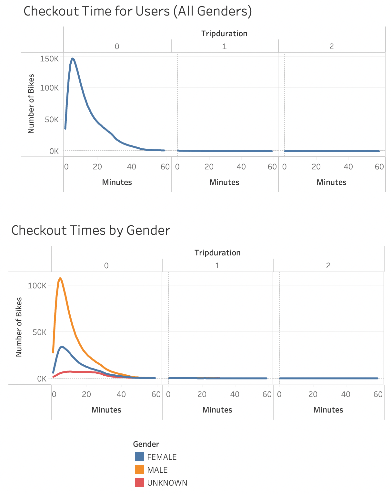

# Bikesharing - From the New York to Des Moines

## Overview
CitiBike in New York City offers residents and tourists alike the opportunity to save on gas, get some exercise all while enjoying all the city has to offer. This analysis looked at who specifically is using CitiBikes (by payer type and by gender) and when they are most likely to be using them. This information is essential to understanding how the CitiBike program in New York could be applied to other cities in the United States.  

## Results

 
The top image depicts when bikes are most often being checked out for all user types and all genders. The bottom image breaks this down by gender. We can see from this image that men and women are checking bikes out at similar times however overall men are checking out more bikes tham women. 

 [Link to additional CitiBike program information](https://public.tableau.com/profile/cami.mandell.gorden#!/vizhome/Module14Challenge_16196499609200/UserTripsbyGenderbyWeekday)

## Summary
The results from this analysis show that the majority of those using CitiBikes are male subscribers. During the weekday most bike use appears to be from those commuting to and from work, as shown by the hours the bikes are being used. On the weekends the bikes appear to be used mostly for afternoon trips around the city. We can also see that most bikes are checked out and returned to more densely populated areas in the city. From this information it may be inferred that in order to best succeed at starting a CitiBike program in Des Moines, Iowa we should put bikes in areas that are more densly populated and close to large places of business. It would also be beneficial to market the subscription service to encourage regular bike use as well as employ specific advertising to target women riders as they seem to be using the bikes less.   
Additional visualizations that would be beneficial to better understand the data would be:
1. A visualization that breaks down bike use by day of the week by age. 
2. A visualization that breaks down user type by age.   These visualizations would be helpful to see how age affects use in order to create age-speficic marketing and advertizing. 
